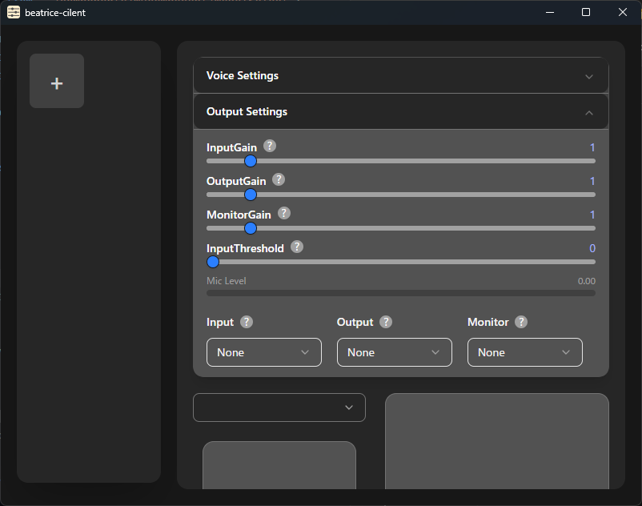

# beatrice-client

ボイスチェンジャー `Beatrice` の GUI です。

https://prj-beatrice.com/

## 使用方法

アプリのダウンロード: [Releases](https://github.com/aq2r/beatrice-client/releases)

Beatrice `2.0.0-beta.0` ~ `2.0.0-rc.0` のモデルに対応しています。

## 動作環境

想定環境は Windows 11 です。

# License - Beatrice

このアプリ `beatrice-client` は `Project Beatrice` https://prj-beatrice.com/ の許諾を受けて

Beatrice の推論ライブラリ `beatrice.lib` を利用しています。

この許諾は、`beatrice-client` の開発に要する合理的な範囲での利用及び

`beatrice-client` を改変せずに頒布・譲渡する行為のみを認めるものです。

この範囲を超えて利用する場合は `Project Beatrice` に許諾を得る必要があります。

 

`beatrice.lib` は以下のライブラリを使用しています。

- PocketFFT

  Copyright 2010-2018 Max-Planck-Society

  BSD-3-Clause License

  https://gitlab.mpcdf.mpg.de/mtr/pocketfft/-/blob/cpp/LICENSE.md

- fmath

  Copyright MITSUNARI Shigeo

  BSD-3-Clause License

  https://github.com/herumi/fmath#license

#

`beatrice_lib` 内のコードは [beatrice-vst](https://github.com/prj-beatrice/beatrice-vst) のコードを参考に作成しました。

#

## アップデート履歴

- v0.4.0
  - 全体を書き換え
  - サンプリングレート周りのバグを修正
  - UIを変更
  - 一定以上音量が小さいと変換しないようにする機能を追加

- v0.3.0
  - Beatrice 2.0.0-rc.0 のモデルに対応
  - 詳細設定を追加

- v0.2.2
  - アプリ起動時に正しくピッチとフォルマントが反映されないバグを修正

- v0.2.0
  - Beatrice2 beta-0 (alpha版) のモデルに対応

- v0.1.0
  - アプリリリース
