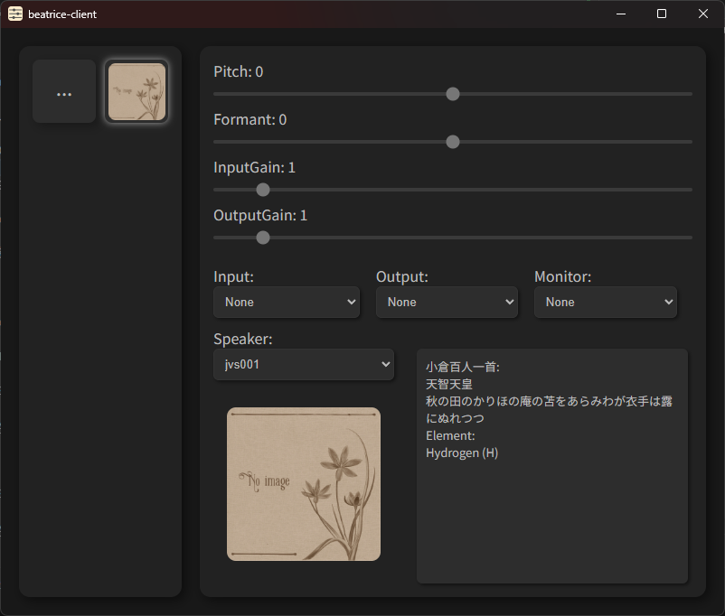

# beatrice-client

ボイスチェンジャー `Beatrice`  の GUI です。 

https://prj-beatrice.com/

## 使用方法

アプリのダウンロード: [Releases](https://github.com/aq2r/beatrice-client/releases)
使用するにはアプリの起動後、左上の `...` から Beatrice の

モデルフォルダーがあるフォルダーを選択し、表示されたモデルを選択します。

Beatrice `2.0.0-beta1` ~ `2.0.0-beta4` のモデルに対応しています。

それ以前のモデルには対応していないためご注意ください。

## 動作環境

想定環境は Windows 11 です。

# License - Beatrice

このアプリ `beatrice-client` は `Project Beatrice` https://prj-beatrice.com/ の許諾を受けて 

Beatriceの推論ライブラリ `beatrice.lib` を利用しています。

この許諾は、`beatrice-client` の開発に要する合理的な範囲での利用及び

`beatrice-client` を改変せずに頒布・譲渡する行為のみを認めるものです。

この範囲を超えて利用する場合は `Project Beatrice` に許諾を得る必要があります。

 

`beatrice.lib` は以下のライブラリを使用しています。

- PocketFFT

    Copyright 2010-2018 Max-Planck-Society

    BSD-3-Clause License

    https://gitlab.mpcdf.mpg.de/mtr/pocketfft/-/blob/cpp/LICENSE.md

- fmath

    Copyright MITSUNARI Shigeo

    BSD-3-Clause License

    https://github.com/herumi/fmath#license

#

`beatrice_lib` 内のコードは [beatrice-vst](https://github.com/prj-beatrice/beatrice-vst) のコードを参考に作成しました。
